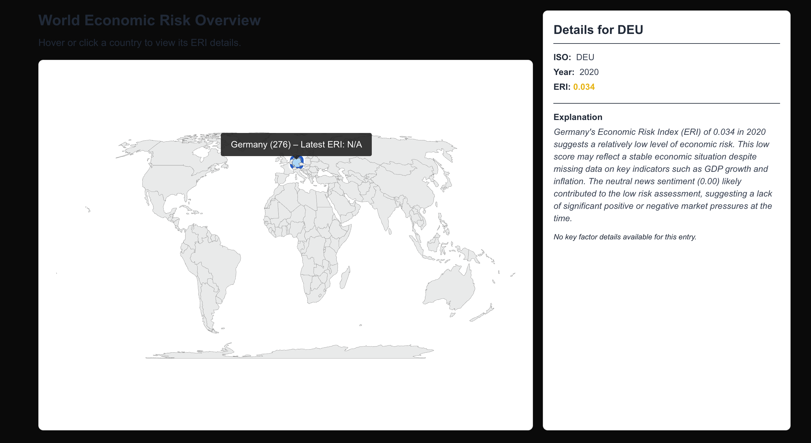

# 🌐 Financial Crisis Prediction System

A multi-modal early-warning system that predicts financial and economic crises by fusing **macroeconomic indicators**, **credit expansion**, and **news-sentiment analysis**.  
The project is inspired by **Chris Reimann (2022)** and extended with a modern, end-to-end ML pipeline and an interactive dashboard.

---

## 🎯 Project Goals

- Predict financial crises at the country level using macro-financial time-series data.  
- Integrate real-time **news sentiment** with structured macroeconomic indicators.  
- Provide an interpretable and actionable **Economic Risk Index (ERI)**.  
- Deliver insights via a web-based dashboard for policymakers and researchers. 

---

### 🧠 Machine- & Deep-Learning Models
- **XGBoost** for gradient-boosted tree ensembles.  
- **LSTM** for sequence-aware, time-series prediction.  
- Additional baselines: Logistic Regression, SVM, Random Forest, Extra Trees, KNN, and MLP.  
- Fully modular experiment framework supporting in-sample, cross-validation, and pseudo-out-of-sample forecasts. 

### 🛠 Data Pipelines
| Source | Coverage | Script |
|--------|----------|--------|
| **World Bank API** | 1960 – 2023 | `worldbank_ingest.py` |
| **IMF WEO** | 2024 – 2028 (projections) | `imf_ingest.py` |
| **GDELT** | 2015 – present (news) | `gdelt_ingest.py` |
| **Twitter** | twitter - Kaggle dataset | `twitter_loader.py` |
| **MongoDB** | News storage | native connection |

### 💬 Sentiment Analysis
- **VADER** rule-based scoring for quick polarity estimates.  
- **FinBERT** transformer model (Bullish / Bearish / Neutral).  
- News-preprocessing: cleaning, keyword extraction, de-duplication.  
- Sentiment aggregated by country-year (or month for high-frequency variants).  

## ✨ Recent Contributions

This fork introduces several key enhancements:

- **✅ Refactored** `worldbank_ingest.py` to include 15 countries and indicators from 1960–2023.  
- **✅ Integrated** IMF WEO data, covering up to 2028 forecasts.  
- **✅ Introduced** XGBoost and LSTM support in the pipeline.  
- **✅ Added** robustness testing with ESRB and Laeven & Valencia labels.  
- **✅ Improved** visualizations: ROC curves, ALE plots, AUC tables.

---

## 📦 Highlights & Contributions

- ✅ **End-to-end macroeconomic & sentiment ingestion pipelines**  
- ✅ **Modular architecture** with plug-and-play ML models  
- ✅ **FinBERT integration** for advanced news sentiment  
- ✅ **Real-time & historical ERI dashboard** for visualisation  
- ✅ **MongoDB storage** of full-text articles  
- ✅ Built-in **ROC, AUC & calibration** diagnostics  
- ✅ Easily **extendable** to new countries and indicators  

---

## 📚 Reference

Reimann, C. (2022). *Predicting Financial Crises: An Evaluation of Machine Learning Algorithms and Model Explainability for Early Warning Systems.*  

---

## 📩 Contact

| Role   | Details |
|--------|---------|
| **Author** | Rasul Chsheriyazdanov |
| **GitHub** | [@rassulchsh](https://github.com/rassulchsh) |
| **Email**  | rassulbayern@outlook.de |

